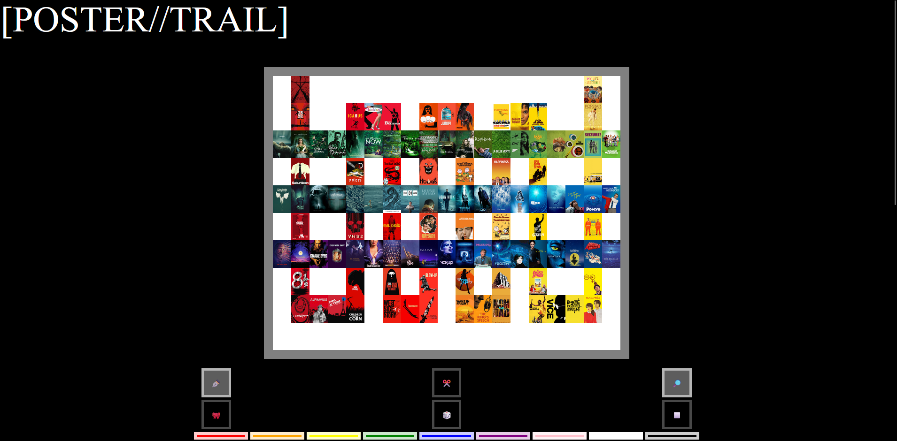
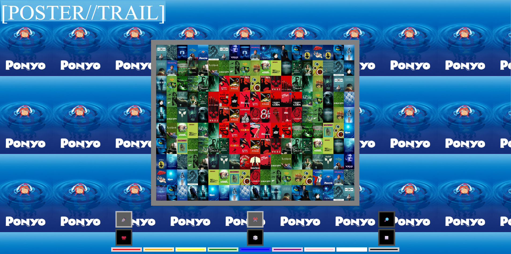
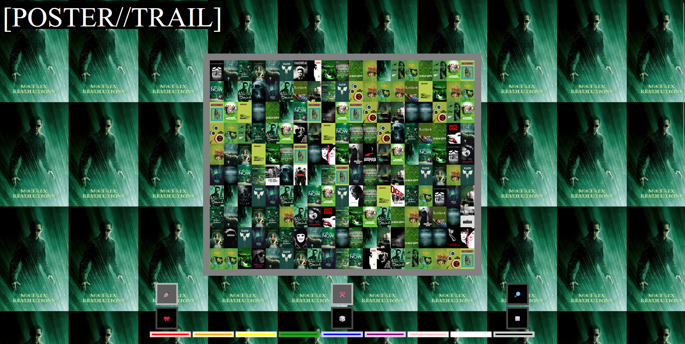

# Documentation



[POSTER//TRAIL](https://dreamerkj.github.io/final/) is a web toy that allows the user to draw with movie posters. The user is allowed to select the color palette that the cursor's "poster//trail" will be in, draw, erase, and also change the site's background to a specific repeating poster.



---

```js
var activeList = [];

for(let i=1 ; i<= 190 ; i++) {
    activeList[i-1] = i;
}

...

var currBg = 0;
function nextBg() {
    currBg++;
    return "url(movies/" + activeList[(currBg-1)%(activeList.length)] + ".jpg)"
}
```
This is my favorite section of my code, which is the part where you draw based on the "activeList". The activeList is decided based on which colors you have selected, and the "poster//trail" loops in the activeList over and over. 

There were many ways to achieve the same effect, but I think this is one of the more efficient and clean ways to do it. (And it took me a while) So I'm proud of it.



---

I learned a lot through this website in particular, and gained an interest in making similar web toys. Although I researched how to keep both low-res and hi-res copies of the posters and use the hi-res only when loaded, the bottleneck came down to compressing 190 images to a low-res version, which I couldn't accomplish in time. I hope to do so in future versions I make.

<video controls src="DemoVideo.mp4" title="Scribble Scribble"></video>